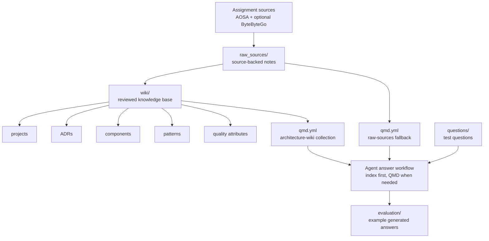

# Architecture Wiki

This repository is a short, source-backed knowledge base for answering software
architecture questions with an LLM. It keeps raw architecture notes separate
from reviewed wiki pages, then uses QMD retrieval to help agents find grounded
answers quickly.



## How It Works

The raw notes in `raw_sources/` preserve architecture facts and source URLs.
The reviewed wiki in `wiki/` turns those notes into concise project pages, ADRs,
components, patterns, and quality-attribute pages. Agents start at
`wiki/index.md`, prefer reviewed pages, and only fall back to raw notes when a
claim needs verification or reviewed coverage is missing.

QMD provides the retrieval layer:

```bash
qmd status
qmd query "<architecture question>" -c architecture-wiki -n 8 --no-rerank --full-path
qmd query "<fallback question>" -c raw-sources -n 8 --no-rerank --full-path
```

## Important Files

- `docs/final-report.md`: short report explaining the design and assignment fit
- `docs/wiki-design-decisions.md`: wiki structure and design rationale
- `AGENTS.md`: instructions for agents using the knowledge base
- `questions/typical-architecture-questions.md`: provided testing questions
- `evaluation/evaluation-results.md`: generated answers used for evaluation
