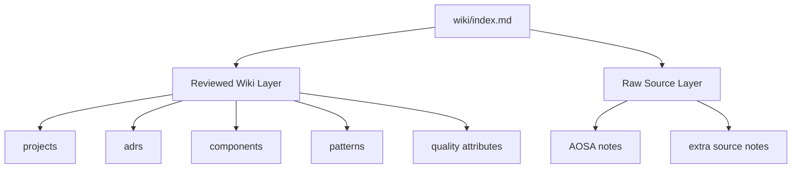

# Software Architecture Wiki Final Report

## 1. Project Goal

The project implements an Architecture Wiki that acts as a source-backed
knowledge base for answering software architecture questions. It is designed for
LLM-assisted use: reviewed Markdown pages keep answers compact, traceable, and
easier to validate than direct prompting over large raw source notes.

## 2. Assignment Interpretation

The assignment requires a knowledge base that can answer both general and
project-specific architecture questions, incorporate AOSA descriptions, justify
wiki design decisions, support chatbot-style use, collect typical questions, and
evaluate generated answers through manual validation.

The assignment PDF links to Karpathy's LLM Knowledge Bases post, Karpathy's LLM
Wiki idea file, AOSA, and ByteByteGo. This repository uses those linked sources
as follows:

- [Karpathy's LLM Knowledge Bases post](https://x.com/karpathy/status/2039805659525644595):
  motivates the chatbot-facing, token-saving knowledge-base goal.
- [Karpathy's LLM Wiki idea file](https://gist.github.com/karpathy/442a6bf555914893e9891c11519de94f):
  motivates the raw-source, reviewed-wiki, and schema-rule structure documented
  in `docs/llm-wiki-idea.md` and `AGENTS.md`.
- [AOSA](http://aosabook.org/): provides the minimum required architecture
  source layer under `raw_sources/aosa/`.
- [ByteByteGo Newsletter](https://blog.bytebytego.com/): provides optional
  high-quality extra system-design sources under `raw_sources/extra_sources/`.

This repository implements that scope with:

- raw AOSA and optional extra source notes under `raw_sources/`
- reviewed project, ADR, component, pattern, and quality-attribute pages under
  `wiki/`
- an index-first retrieval workflow through `wiki/index.md`
- real QMD collection search through `qmd.yml`
- structural and retrieval validation under `scripts/`
- generated answers and manual validation under `evaluation/`

## 3. Source Selection

The raw source layer includes:

- 49 AOSA project source notes plus `catalog.md` under `raw_sources/aosa/`
- 6 optional extra source notes under `raw_sources/extra_sources/`, including
  ByteByteGo API gateway, caching, sharding, reliability, messaging, and
  architecture-pattern articles

The reviewed layer currently synthesizes nine AOSA projects:

- nginx
- Git
- Mercurial
- MediaWiki
- Moodle
- Hadoop HDFS
- LLVM
- Eclipse
- Jitsi

It also synthesizes generic distributed-systems concepts from the extra sources,
including API Gateway, Message Broker, API Gateway Topology Tradeoffs,
Asynchronous Messaging, Caching Strategies, Database Sharding, Distributed
Reliability, Event Sourcing, Plugin Architecture, Load Balancing, Availability,
and Consistency.

## 4. Knowledge-Base Design



### Raw Source Layer

Raw notes preserve source-oriented architecture facts and source URLs. They are
used as verification inputs and as future ingestion material.

### Reviewed Wiki Layer

Reviewed pages are the preferred answer layer. They are short, linked, and
structured for retrieval:

- `wiki/projects/`: project architecture summaries
- `wiki/adrs/`: MADR-style architectural decisions
- `wiki/components/`: reusable component descriptions
- `wiki/patterns/`: reusable pattern descriptions
- `wiki/quality-attributes/`: cross-project quality comparisons

### ADRs and Architecture Haiku

Project pages include concise architecture summaries inspired by architecture
haiku, while ADRs document major decisions with context, decision,
consequences, considered options, and links to components, patterns, quality
attributes, and source notes.

### Retrieval

The workflow starts from `wiki/index.md`, then opens reviewed pages. When the
index is not enough, agents use QMD:

```bash
qmd search "query terms" -c architecture-wiki
qmd query $'lex: query terms\nvec: semantic retrieval terms' -c architecture-wiki --no-rerank
```

The `qmd.yml` config describes the `wiki/` and `raw_sources/` collections. QMD
has been installed and the collections have been indexed and embedded locally.

### Validation

The structural validator runs with no external dependencies:

```bash
node scripts/validate-wiki.mjs
```

It checks relative links, reviewed-page frontmatter, index coverage, source URL
presence, and absolute local file URI portability problems. The full provided
question bank is checked with:

```bash
node scripts/check-questions.mjs
```

That command validates Q01-Q24 against the real QMD `architecture-wiki`
collection, using `raw-sources` only for explicit coverage-gap fallback checks.

## 5. Question Bank

The question bank in `questions/typical-architecture-questions.md` contains 24
typical architecture questions. All 24 are retrieval-checked with QMD. The
scored answer-generation set in `evaluation/evaluation-questions.md` selects 18
questions covering:

- high-level architectural design
- components and interfaces
- data and state management
- architectural styles and patterns
- quality attributes
- cross-project comparisons
- coverage-gap honesty

## 6. Evaluation Results

The generated answers are stored in `evaluation/evaluation-results.md`. The
manual validation report is stored in `evaluation/manual-validation.md`.

The evaluation demonstrates that:

- project-specific AOSA questions can be answered from reviewed project,
  component, ADR, pattern, and quality pages
- general system-design questions now use reviewed generic pages for API
  gateways, messaging, caching, sharding, distributed reliability, availability,
  and consistency
- when reviewed coverage is incomplete, the answers identify the limitation and
  cite raw source notes only as fallback evidence
- QMD retrieval coverage is checked for every provided question, including
  Q18-Q24
- every answer follows the required `Question`, `Pages consulted`, `Answer`,
  and `Sources used` structure

## 7. Current Limitations

The project intentionally keeps the reviewed layer concise. The main remaining
limitations are:

- nine AOSA projects have full reviewed project pages so far; many other AOSA
  notes remain source-only
- more specialized pages could still be added for service discovery,
  observability, load-balancer internals, and additional raw-source-only AOSA
  projects

## 8. Conclusion

The implementation satisfies the assignment as a git-managed Architecture Wiki:
it incorporates AOSA material, extends it with optional high-quality extra
sources, explains its design decisions, supports chatbot-style retrieval,
contains typical architecture questions, and evaluates generated answers through
manual validation.
