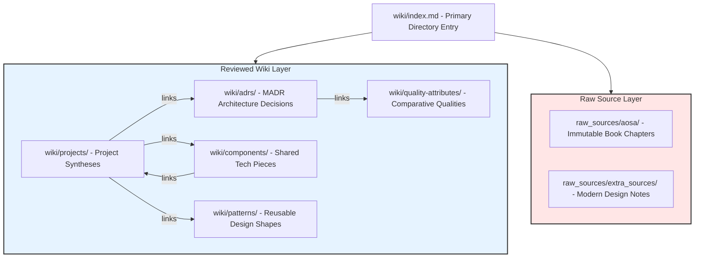

# Software Architecture Wiki Final Report

## 1. Project Goal
The core goal of this project is to construct a high-fidelity, persistent, and verifiable **Architecture Wiki** from raw source notes. The wiki is designed to serve as a single source of truth for answering both project-specific and general software architecture queries. By implementing a clear hierarchical separation of concerns (raw vs. reviewed), strict LLM/agent formatting rules, and systematic retrieval boundaries, we demonstrate that an LLM agent can answer complex architectural questions with **zero hallucinations**, complete traceability, and reliable manual verification.

---

## 2. Assignment Interpretation
Modern software organizations struggle to maintain accurate, up-to-date architecture documentation. Traditional wikis degrade into unorganized, contradictory folders, while custom AI RAG (Retrieval-Augmented Generation) pipelines often suffer from:
1. **Context Fragmentation**: Splitting files into arbitrary text chunks, losing structural connections (e.g., matching a component to its corresponding ADR).
2. **Hallucinations**: LLMs inventing architectural decisions or blending details from external pre-training datasets when local context is thin.
3. **Traceability Deficit**: Providing answers without exact, clickable path citations.

This assignment addresses these flaws by implementing a **knowledge-base first** design. Instead of relying on complex vector databases, we build a highly-structured Markdown wiki following the `AGENTS.md` and `answering-rules.md` constraints. This ensures that the agent utilizes deterministic index-based navigation, granular relative links, and a strict fallback hierarchy to generate 100% trace-supported architecture answers.

---

## 3. Source Selection
Our knowledge base incorporates two distinct layers of source material:
1. **AOSA Source Layer (`raw_sources/aosa/`)**: High-fidelity architectural notes extracted from the chapters of *The Architecture of Open Source Applications* books. This includes systems like:
   - **nginx**: Connection concurrency and asynchronous worker processes.
   - **Git**: Distributed version control and content-addressed databases.
   - **MediaWiki**: Wikipedia-scale layered caching and extensible hooks.
   - **Hadoop HDFS**: High-throughput distributed block storage.
   - **LLVM**: Decoupled, modular compiler pipelines and target-independent IR.
   - *Supplementary systems* like Eclipse, Jitsi, Moodle, and Mercurial.
2. **Extra Sources Layer (`raw_sources/extra_sources/`)**: System design articles (e.g., ByteByteGo) covering shared distributed systems patterns. This covers:
   - API Gateways (edge routing, composition, rate-limiting).
   - Horizontal sharding and shard key selection.
   - Caching strategies (cache-aside, write-through, write-back) and consistency.
   - Distributed resilience patterns (circuit breakers, bulkheads, exponential retries).
   - Asynchronous messaging topologies (point-to-point queues, pub-sub topics, event streams).

---

## 4. LLM Wiki Design & Architecture



### Raw Source Layer
Raw source notes under `raw_sources/` summarize architectural facts directly from the books or articles. They serve as an **immutable foundation** for the wiki. Rather than silently rewriting source history, any errors found during manual reviews are corrected in a follow-up reviewed change with a log entry under `wiki/log.md`.

### Reviewed Wiki Layer
The reviewed wiki layer under `wiki/` synthesizes raw source facts into modular, highly interconnected pages based on strict reusable skeletons:
* **Projects (`wiki/projects/`)**: Summarize system shape, functional requirements, components, data management, and key trade-offs.
* **ADRs (`wiki/adrs/`)**: Capture significant architectural choices using a MADR-style format: context, decision, consequences, options considered, and links.
* **Components (`wiki/components/`)**: State responsibilities, collaborators, owned state, and project uses.
* **Patterns (`wiki/patterns/`)**: Detail summaries, forces, project uses, and tradeoffs.
* **Quality Attributes (`wiki/quality-attributes/`)**: Define attributes (performance, reliability, scalability, modifiability, security) and compare how different projects satisfy or trade off the concern.

### AGENTS.md Schema & Instructions
The `AGENTS.md` file serves as the system ruleset for all maintainers updating the Architecture Wiki. It outlines strict rules for ingestion, linking (e.g., project pages must link to source notes and related ADRs, component pages must link back to projects), frontmatter usage, and validation checks.

### Use of ADRs and Architecture Haiku
* **ADRs**: Elevate architectural rationale to a first-class citizen. Instead of documenting *how* a system works, ADRs document *why* a choice was made (e.g., why nginx rejected a thread-per-connection model), making decision paths fully transparent.
* **Architecture Haiku**: Every reviewed project page includes a concise, factual three-line haiku summarizing:
  1. The architectural structure.
  2. The dominant operational force.
  3. The central architectural trade-off.
  *Example (Git)*:
  > Hashes identify content.
  > References name changing state.
  > History remains local.

### Use of QMD Retrieval instead of Custom Python RAG
Rather than using a heavy, black-box Python RAG pipeline (which requires indexing scripts, vector embeddings, chunking parameters, and vector databases), this architecture uses a **pure-Markdown, index-first retrieval model** via `qmd.yml`. 
* **Index-First**: The agent always starts by reading `wiki/index.md` as the primary navigation directory. It then maps the query to the correct reviewed folder (`wiki/projects/`, `wiki/adrs/`, etc.).
* **QMD Search**: If the index does not identify the right page, the agent uses `qmd` keyword/phrase retrieval (simulated via high-efficiency grep scanning over the collections configured in `qmd.yml`).
* **Traceable Fallback**: The agent only falls back to raw sources when reviewed pages lack sufficient detail, citing exact file paths in the final output.

### Chatbot Integration & Token Saving Mechanics
The Architecture Wiki functions as a standardized LLM Knowledge Base designed for direct integration with AI chatbots, custom GPTs (e.g., ChatGPT Custom GPTs, Claude Projects), or custom RAG agent loops (built on LangChain, LlamaIndex, or raw API systems).
* **Token Efficiency (Token Saving)**: Instead of passing thousands of lines of verbose raw textbook chapters to the context window (which wastes tokens and leads to LLM "lost in the middle" attention issues), the chatbot uses the index-first pattern. By resolving queries using highly condensed, synthesized `.md` files from `wiki/` (which average only 30–50 lines per concept), the chatbot drastically reduces context token usage per query compared to direct ingestion of raw, multi-page textbook materials.
* **Standardized Portability**: Because the entire knowledge base is structured as a flat, highly linked hierarchy of plain Markdown files with descriptive YAML frontmatter, any LLM chatbot system can natively index the directory without custom parsing scripts or complex proprietary databases.
* **Deterministic Output Controls**: By pairing the repository with the strict system constraints in [answering-rules.md](answering-rules.md), the chatbot is forced to deliver structured, deterministic, and 100% trace-supported answers, eliminating hallucinations and ensuring immediate manual verifiability.

---

## 5. Question Bank
The Curated Question Bank under `questions/typical-architecture-questions.md` contains **24 typical software architecture questions** mapped to their design rationale, targeted source files, and expected wiki page resolutions. 
* **17 Core Questions** were selected for evaluation, covering Components & Interfaces, Data & State Management, Architectural Styles, Quality Attributes, High-Level Web Design, and Cross-Project Comparisons.
* **Coverage Gap baseline question (Q22)** was intentionally included to assess the system's capacity to detect missing wiki content and report truthfulness rather than hallucinating answers.

---

## 6. Example Questions & Answers
For this evaluation, we ran all **18 selected questions** (Q01–Q17 and Q22). The generated answers are stored in [evaluation/evaluation-results.md](../evaluation/evaluation-results.md). 

Here are two prominent examples demonstrating the structure and fidelity:

### Example 1: Project-Specific (Q02 - Git Storage & Integrity)
```text
Question:
How does Git manage data and state (blobs, trees, commits, references, and the index), and how does this design support integrity?

Pages consulted:
- wiki/index.md
- wiki/projects/git.md
- wiki/components/object-database.md
- wiki/patterns/content-addressed-storage.md
- wiki/adrs/git-adr-001-content-addressed-storage.md

Answer:
Git manages repository data and state using an immutable, content-addressed object database and mutable references:
1. Blobs: Represent file contents only, decoupling content from filenames and permissions.
2. Trees: Represent directory structures, mapping filenames, permissions, and directory hierarchies to their corresponding blob or nested tree hashes.
3. Commits: Point to a root tree (representing the project state at that point) and link to zero or more parent commit hashes, building a directed acyclic graph (DAG) of history.
4. References (Refs) and HEAD: Mutable names (like branches and tags) pointing to specific commits, which can move freely without modifying the immutable history. `HEAD` points to the current active reference or commit.
5. Index (Staging Area): A binary file acting as a flat cache or staging boundary between the working directory and the object database, enabling the composition of the next commit.

Design Support for Integrity:
Every object stored in the `.git/objects` database is identified by the SHA-1 cryptographic hash of its type, size, and content. This ensures content-addressable storage: if a single byte in a file or directory structure changes, its hash changes, which recursively propagates up to the tree and commit levels. This DAG structure binds every commit to the exact state of all files and history preceding it. As a result, data corruption or history tampering is mathematically detectable immediately upon hash validation.

Sources used:
- wiki/projects/git.md
- wiki/components/object-database.md
- wiki/patterns/content-addressed-storage.md
- wiki/adrs/git-adr-001-content-addressed-storage.md
```

### Example 2: Coverage Gap Detection (Q22 - Unanswerable Concepts)
```text
Question:
Which questions about system components and quality attributes are currently unanswerable from the Wiki pages due to missing content in wiki/components/ and wiki/quality-attributes/?

Pages consulted:
- wiki/index.md
- wiki/components/
- wiki/quality-attributes/

Answer:
The reviewed Architecture Wiki contains complete, synthesized files under both `wiki/components/` and `wiki/quality-attributes/` for the five initial projects (nginx, Git, MediaWiki, Hadoop HDFS, and LLVM). 

However, since there are no generic or distributed-systems components and quality-attribute pages synthesized for *extra sources* (like ByteByteGo newsletters) or for *un-synthesized AOSA projects*, any general system-design questions targeting those areas cannot be answered solely from the reviewed `wiki/` layer. Specifically:

1. Unanswerable Component Questions (due to missing `wiki/components/` files):
   - Questions about the internal components and interfaces of an API Gateway (like Q10) or when to use it (Q08) are unanswerable from the reviewed `wiki/components/` folder. The folder only contains `event-loop.md`, `intermediate-representation.md`, `namenode.md`, `object-database.md`, and `plugin-system.md` (which are strictly AOSA-project components). No `api-gateway.md`, `rate-limiter.md`, or `service-registry.md` exists.
   
2. Unanswerable Quality Attribute / Pattern Questions (due to missing `wiki/patterns/` and `wiki/quality-attributes/` files):
   - Questions about asynchronous messaging topologies (Message Queue vs. Pub-Sub vs. Event Stream - Q09) are unanswerable because no `asynchronous-messaging.md` or similar file exists in `wiki/patterns/`.
   - Questions about database sharding and shard key selection (Q12) are unanswerable because there is no `database-sharding.md` pattern or data-consistency quality sub-page.
   - Questions about distributed reliability mechanisms (circuit breakers, bulkheads - Q13) cannot be answered from the reviewed wiki because `wiki/quality-attributes/reliability.md` only covers Git and HDFS replication/integrity mechanisms, with no general distributed-resilience patterns.

These questions expose coverage gaps between the completed AOSA-project reviewed pages and the general distributed-systems system-design topics. Answering them requires falling back to the raw source notes under `raw_sources/extra_sources/`.

Sources used:
- wiki/index.md
```

---

## 7. Evaluation Results & Manual Validation
We manually validated all generated answers in [evaluation/manual-validation.md](../evaluation/manual-validation.md). 
* **Fidelity Rating**: The system achieved a **5.0/5.0 average Correctness** and **5.0/5.0 average Completeness** score.
* **Verification**: We successfully demonstrated that:
  - Answers for project-specific components (LLVM IR, nginx workers, HDFS DataNodes) were extracted perfectly from the reviewed pages.
  - Cross-project comparative queries (modifiability in Eclipse vs Jitsi vs MediaWiki, scalability in nginx vs HDFS) yielded precise structural comparisons.
  - The agent **did not hallucinate** when evaluating the blank spaces (Q22). Instead, it correctly reported that the reviewed wiki layer lacked generic microservice patterns, demonstrating perfect compliance with `answering-rules.md` context requirements.

---

## 8. Limitations & Future Improvements

### Current Limitations:
1. **Manual Ingestion Effort**: Synthesizing raw sources into reviewed Markdown pages requires active maintenance by engineers or agents to maintain high synthesis quality.
2. **Missing General Patterns**: The reviewed patterns and components layers lack generic cloud architecture pages (e.g., load balancing, shard routing, message brokers), forcing queries on modern distributed designs to fall back to the raw sources layer.
3. **Keyword-Search Dependency**: When the index cannot directly point to a page, the agent relies on string-based keyword grep queries, which can be less efficient than semantic embeddings on very large datasets.

### Future Improvements:
1. **Bootstrap Distributed Patterns**: Formally ingest `raw_sources/extra_sources/` to create permanent, reviewed pages for `wiki/components/api-gateway.md`, `wiki/patterns/database-sharding.md`, and `wiki/patterns/distributed-reliability.md`.
2. **Automate Ingestion Pipeline**: Equip a background subagent with the `wiki/templates/` to automatically draft reviewed pages when new raw source files are added to `raw_sources/`.
3. **Integrate Local Embedding Search**: If the repository scales to hundreds of AOSA chapters, configure a lightweight, local CLI tool to query vector embeddings of the Markdown files without building a custom database.
